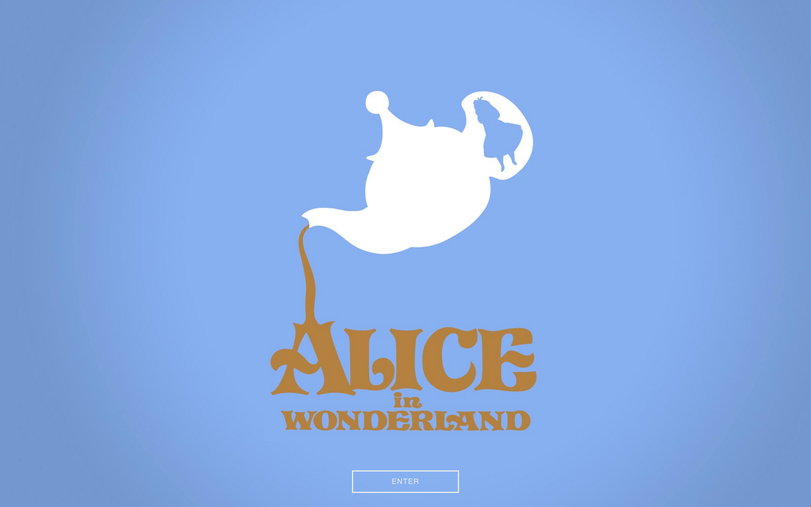

# alice
First WebLab project using HTML and plain CSS.

I used animated buttons from [CSS Buttons](http://cssbuttons.tumblr.com/) but they are currently not completely responsive.
I'm also having issues with my footer, as it's not displaying.

